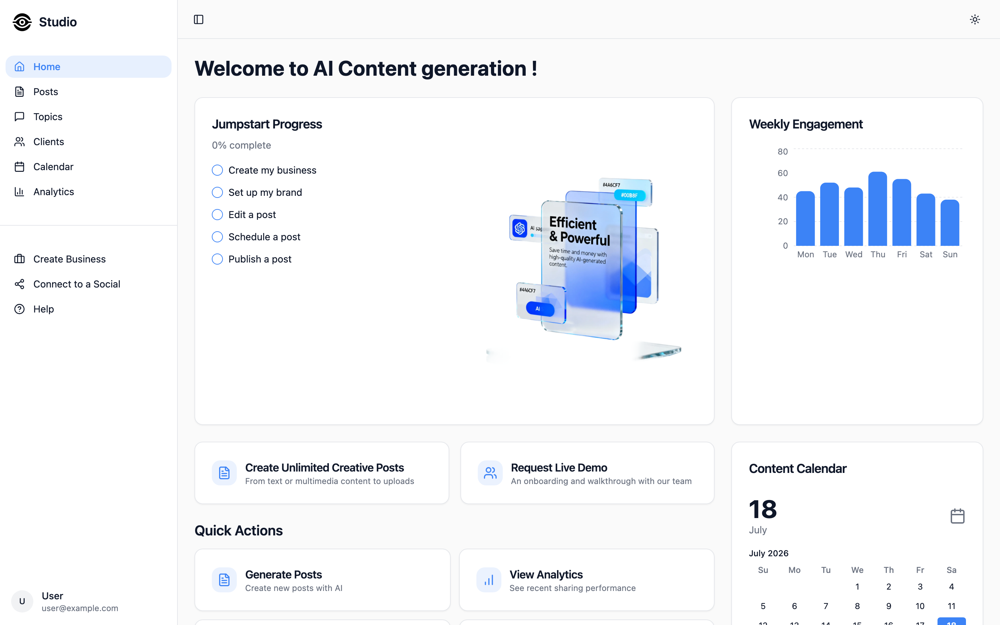
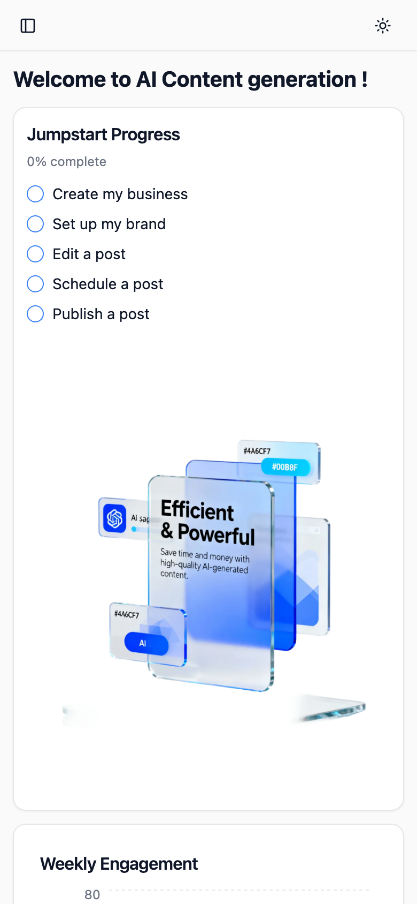
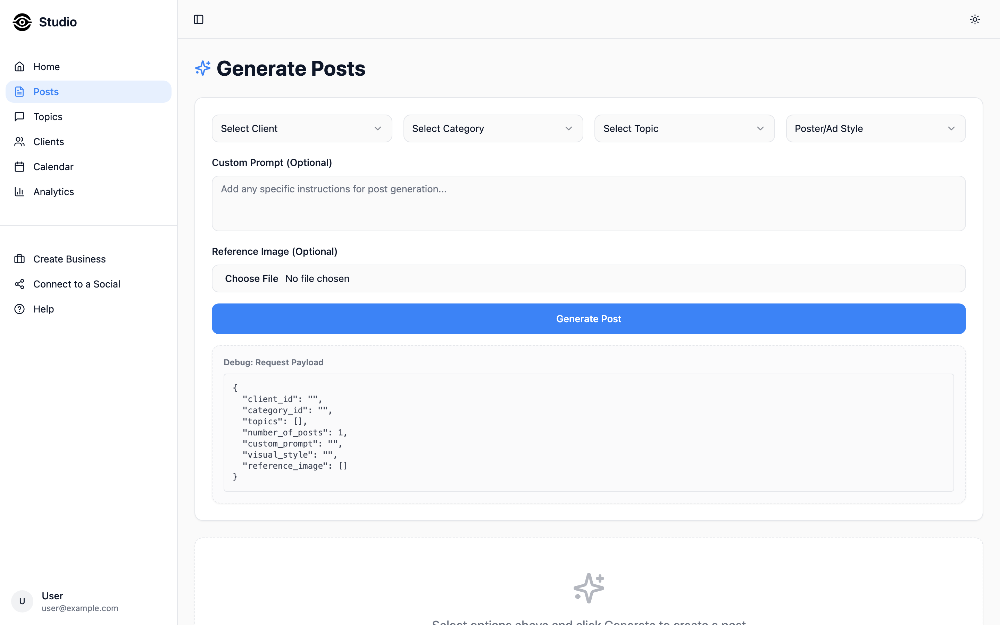
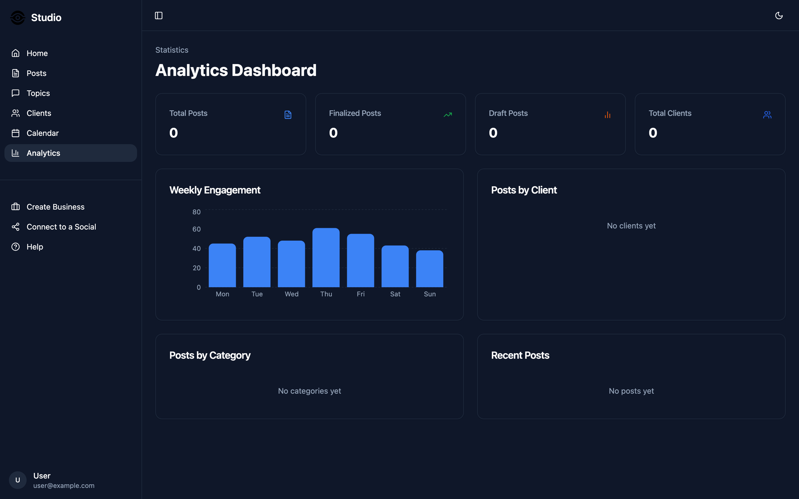

# AI Content Studio 🎨✨

> Your social media content, generated, scheduled and analysed — all from one calm little dashboard.

AI Content Studio is a React dashboard for content teams and agencies who juggle **many
clients and a lot of posts**. Spin up on-brand social posts with AI, sort them into topics,
line them up on a calendar, and keep an eye on how they're doing — without living inside five
different tabs. It's fast, it's tidy, and yes, it does dark mode. 🌙

<p align="center">
  
</p>

---

## ✨ Why it's cool

- **AI post generation** — describe what you want (or upload a reference image) and get
  poster/ad-style social posts back, ready to review.
- **Multi-client by design** — every business you manage is its own workspace: clients,
  topics, and posts stay neatly separated.
- **Topics & categories** — organise the stuff you post about so the AI always has context.
- **Content calendar** — see what's going out and when, at a glance.
- **Analytics** — a weekly engagement view so you know what's actually landing.
- **Light & dark mode** — a proper theme switch that remembers your choice. Kind to eyes at 2am. 🌚
- **Genuinely responsive** — the sidebar collapses, cards reflow, and it behaves on a phone.

<p align="center">
  
  
</p>

<p align="center">
  
  
</p>

---

## 🚀 Quick start (for absolute beginners — nothing assumed)

You'll need **Node.js 18+** and **npm**. Not sure if you have them? Run `node -v`. If that errors,
grab Node from [nodejs.org](https://nodejs.org/) (or use [nvm](https://github.com/nvm-sh/nvm)).

```sh
# 1. Clone the repo
git clone https://github.com/waleedsworld/dental-frontend.git
cd dental-frontend

# 2. Install dependencies (grab a coffee ☕ — it's a big shadcn tree)
npm install

# 3. Point it at your backend
cp .env.example .env
# then open .env and set VITE_BASE_URL to your API's address

# 4. Fire it up with hot reload
npm run dev
```

Now open the URL Vite prints (usually **http://localhost:8080**) and you're in. 🎉

### Other handy commands

```sh
npm run build     # production build → dist/
npm run preview   # preview the production build locally
npm run lint      # tidy check with ESLint
```

---

## 🔌 Configuration

The frontend talks to a backend API for clients, topics, posts and generation. Set its address
in `.env`:

```sh
VITE_BASE_URL=https://your-backend.example.com
```

If you don't set it, the app falls back to a local dev URL, so the UI still loads and you can
click around — the data-driven pages just won't have anything to fetch until a backend is wired up.

---

## 🧱 Tech stack

| Layer      | What we used                                             |
| ---------- | ------------------------------------------------------- |
| Framework  | **React 18** + **TypeScript**                           |
| Build      | **Vite** (SWC-powered, blazing fast)                    |
| UI         | **shadcn/ui** (Radix primitives) + **Tailwind CSS**     |
| Theming    | **next-themes** (persisted light/dark)                  |
| Data       | **TanStack Query** for fetching & caching               |
| Routing    | **React Router**                                        |
| Charts     | **Recharts**                                            |
| Forms      | **react-hook-form** + **zod**                           |

---

## 🗂️ Project structure

```
src/
├── assets/         # logo + imagery
├── components/     # AppSidebar, ThemeToggle, dashboard widgets…
│   └── ui/         # shadcn/ui primitives
├── hooks/          # use-mobile, use-toast
├── lib/            # api.ts (fetch wrapper), utils
├── pages/          # Index, Posts, Topics, Clients, Calendar, Analytics…
├── App.tsx         # routes + providers
└── main.tsx        # entry point
```

---

## 🌐 Live demo

**Deploying soon** — a hosted preview is on the way. For now, `npm run dev` gives you the full
experience in about a minute.

---

## 🤝 Contributing

PRs and ideas welcome. Keep it typed, keep it tidy, run `npm run lint` before you push, and try
not to break dark mode (we're rather fond of it).

---

Made with React, Tailwind, and a slightly unhealthy amount of coffee. ☕
