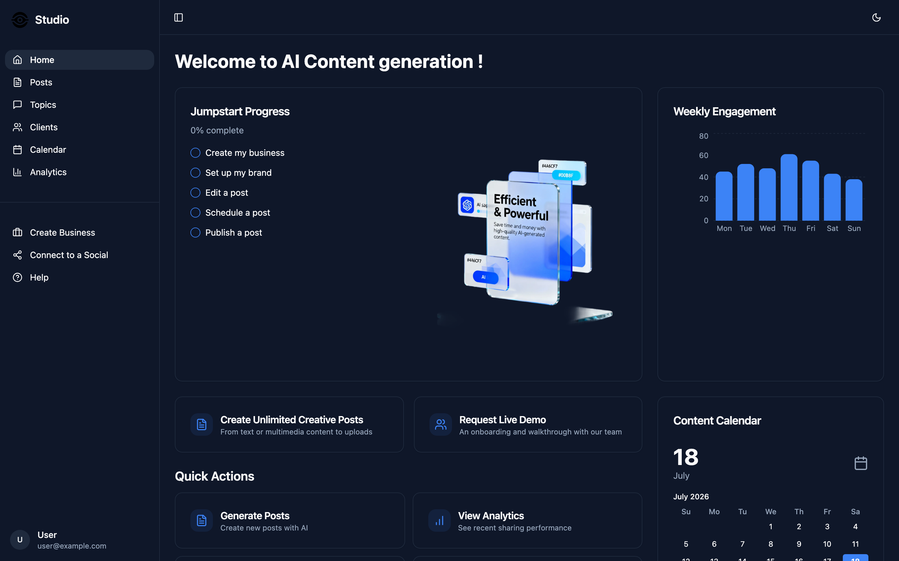
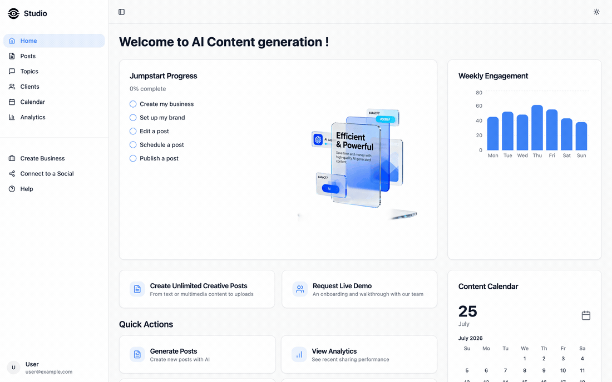

# AI Content Studio 🎨✨

> Your social media content — generated, scheduled and analysed — all from one calm little dashboard.

<p align="center">
  
  
  
  
  
  
  
</p>

AI Content Studio is a React dashboard for content teams and agencies who juggle **many
clients and a lot of posts**. Spin up on-brand social posts with AI, sort them into topics,
line them up on a calendar, and keep an eye on how they're doing — without living inside five
different tabs. It's fast, it's tidy, and yes, it does dark mode. 🌙

<p align="center">
  
</p>

---

## ✨ Why it's cool

- **AI post generation** — describe what you want (or upload a reference image) and get
  poster/ad-style social posts back, ready to review.
- **Multi-client by design** — every business you manage is its own workspace: clients,
  topics, and posts stay neatly separated.
- **Topics & categories** — organise the stuff you post about so the AI always has context.
- **Content calendar** — see what's going out and when, at a glance.
- **Analytics** — a weekly engagement view so you know what's actually landing.
- **Light & dark mode** — a proper theme switch that remembers your choice. Kind to eyes at 2am. 🌚
- **Genuinely responsive** — the sidebar collapses, cards reflow, and it behaves on a phone.

<p align="center">
  
  
</p>

<p align="center">
  
  
</p>

> 🎬 **Want the full walkthrough?** Drop a screen recording at `assets/demo.gif` and it'll
> render right here:
>
> <p align="center"></p>

---

## 🚀 Quick start (for absolute beginners — nothing assumed)

You'll need **Node.js 18+** and **npm**. Not sure if you have them? Run `node -v`. If that errors,
grab Node from [nodejs.org](https://nodejs.org/) (or use [nvm](https://github.com/nvm-sh/nvm)).

```sh
# 1. Clone the repo
git clone https://github.com/waleedsworld/dental-frontend.git
cd dental-frontend

# 2. Install dependencies (grab a coffee ☕ — it's a big shadcn tree)
npm install

# 3. Point it at your backend
cp .env.example .env
# then open .env and set VITE_BASE_URL to your API's address

# 4. Fire it up with hot reload
npm run dev
```

Now open the URL Vite prints (usually **http://localhost:8080**) and you're in. 🎉

### Other handy commands

```sh
npm run build     # production build → dist/
npm run preview   # preview the production build locally
npm run lint      # tidy check with ESLint
```

---

## 🖱️ Usage

Once the app is running and pointed at a backend, a typical loop looks like this:

1. **Pick or create a client.** Everything you do lives inside a client workspace, so your
   brands never bleed into each other.
2. **Set up topics & categories.** These give the AI the context it needs to stay on-brand.
3. **Generate a post.** Describe what you want — optionally attach a reference image — and the
   studio returns poster/ad-style drafts to review, tweak, or discard.
4. **Schedule it.** Drop approved posts onto the content calendar so you can see the week at a glance.
5. **Watch the numbers.** The analytics view charts weekly engagement so you learn what actually lands.

No backend yet? The UI still loads with a local dev fallback URL, so you can click around and
explore every screen — the data-driven pages simply won't have anything to fetch.

---

## 🔌 Configuration

The frontend talks to a backend API for clients, topics, posts and generation. Set its address
in `.env`:

```sh
VITE_BASE_URL=https://your-backend.example.com
```

If you don't set it, the app falls back to a local dev URL, so the UI still loads and you can
click around — the data-driven pages just won't have anything to fetch until a backend is wired up.

---

## 🧱 Tech stack

| Layer      | What we used                                             |
| ---------- | ------------------------------------------------------- |
| Framework  | **React 18** + **TypeScript**                           |
| Build      | **Vite** (SWC-powered, blazing fast)                    |
| UI         | **shadcn/ui** (Radix primitives) + **Tailwind CSS**     |
| Theming    | **next-themes** (persisted light/dark)                  |
| Data       | **TanStack Query** for fetching & caching               |
| Routing    | **React Router**                                        |
| Charts     | **Recharts**                                            |
| Forms      | **react-hook-form** + **zod**                           |

---

## 🗂️ Architecture & project structure

The app is a single-page React client. `main.tsx` boots the tree; `App.tsx` wires up the
providers (TanStack Query, theming, router) and declares the routes. Each route in `pages/`
composes feature widgets from `components/`, which in turn lean on the shadcn/ui primitives in
`components/ui/`. Data flows through a thin fetch wrapper in `lib/api.ts`, and TanStack Query
handles caching, loading and refetch state so components stay declarative.

```
src/
├── assets/         # logo + imagery
├── components/     # AppSidebar, ThemeToggle, dashboard widgets…
│   └── ui/         # shadcn/ui primitives
├── hooks/          # use-mobile, use-toast
├── lib/            # api.ts (fetch wrapper), utils
├── pages/          # Index, Posts, Topics, Clients, Calendar, Analytics…
├── App.tsx         # routes + providers
└── main.tsx        # entry point
```

```
main.tsx  →  App.tsx (providers + router)  →  pages/*  →  components/*  →  components/ui/*
                                                  │
                                             lib/api.ts  ⇄  TanStack Query cache  ⇄  backend API
```

---

## 🌐 Live demo

**Deploying soon** — a hosted preview is on the way. For now, `npm run dev` gives you the full
experience in about a minute.

---

## 🤝 Contributing

PRs and ideas welcome. Keep it typed, keep it tidy, run `npm run lint` before you push, and try
not to break dark mode (we're rather fond of it).

---

## 📄 License

Released under the **MIT License** — see [`LICENSE`](LICENSE) for the full text. Do what you like,
just keep the notice.

---

Made with React, Tailwind, and a slightly unhealthy amount of coffee. ☕
